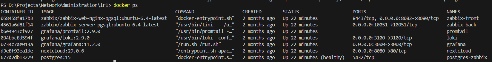
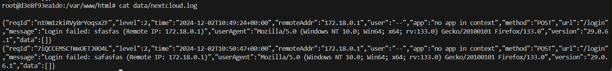
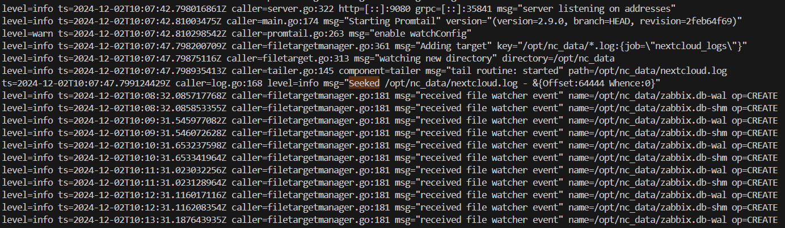
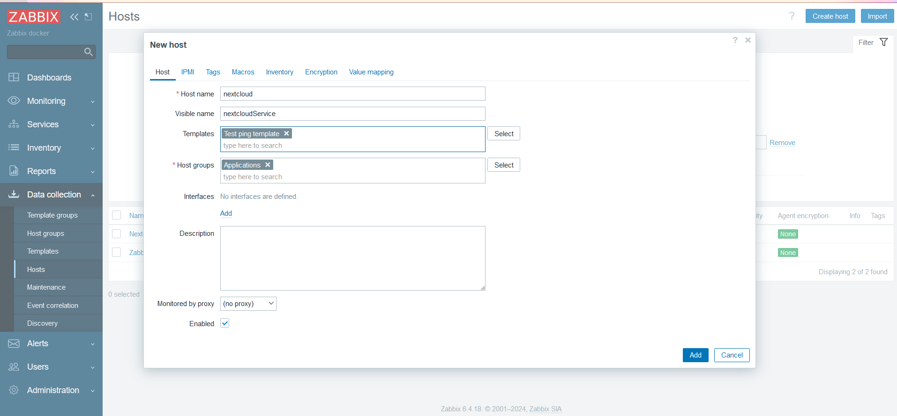
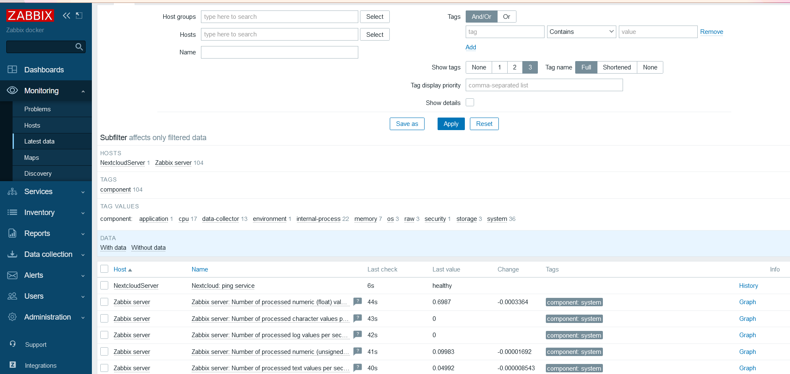
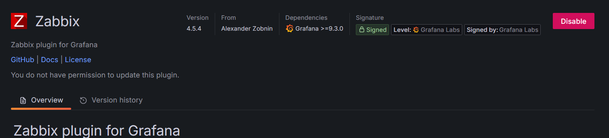
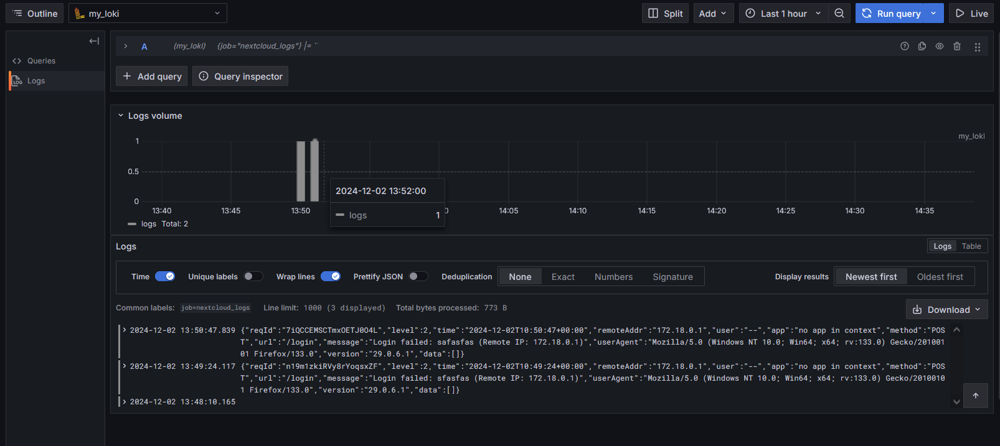
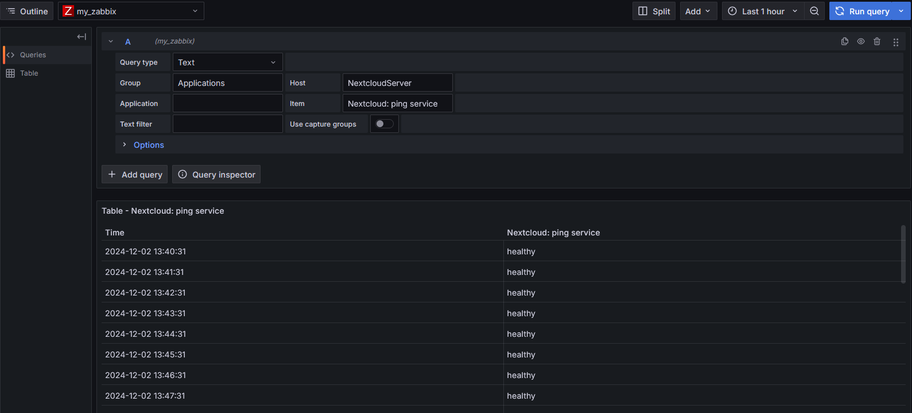
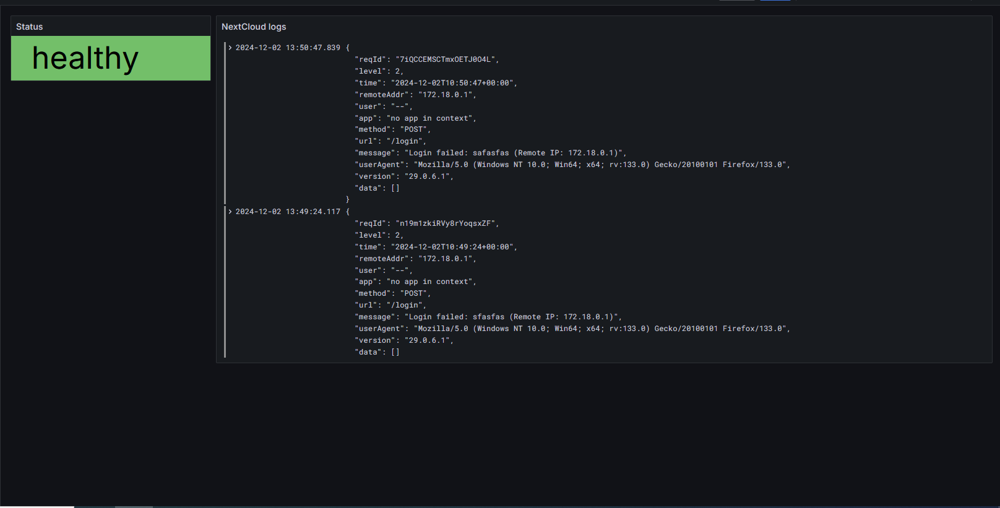

# Лабораторная работа 1

## Ход работы

### Логирование

Для работы сперва надо было поднять контейнеры со следующими сервисами:

* NextCloud - тестовый сервис, на основе которого будет вестись анализ
* Loki - обработчик логов
* Promtail - сборщик логов
* Grafana - визуализация системы мониторинга
* Zabbix - система мониторинга
* Postgres - субд для zabbix

Сервисы были подняты с помощью docker-compose файла с содержанием, описанным в тексте работы.

Помимо докера, нужно было настроить конфиг для promtail

promtail_config.yml

    server:
    http_listen_port: 9080
    grpc_listen_port: 0

    positions:
    filename: /tmp/positions.yaml

    clients:
    - url: http://loki:3100/loki/api/v1/push # адрес Loki, куда будут слаться логи

    scrape_configs:
    - job_name: system # любое имя
    static_configs:
    - targets:
        - localhost # т.к. монтируем папку с логами прямо в контейнер Loki, он собирает логи со своей локальной файловой системы
        labels:
        job: nextcloud_logs # любое имя, по этому полю будет осуществляться индексирование
        __path__: /opt/nc_data/*.log # необязательно указывать полный путь, главное сказать где искать log файлы

С помощью `docker ps` проверяем что контейнеры подняты

Теперь проверяем логирование. Заходим на локал на сервис nextcloud, регистрируем учётку и заходим в неё. Чтобы проверить, то что логи дошли и дошли куда надо зайдём в интерактивный bash-shell контейнера c nextcloud и проверяем логи в /var/www/html/data/nextcloud.log. Также проверяем логи контейнера promtail, что он подтянул нужный лог-файл.

### Мониторинг

Для мониторинга надо настроить заббикс. Заходим на веб заббикса по 8082 порту (из докер-композа) и аутенфицируемся с кредами `Admin:zabbix`. Загружаем кастомный шаблон для мониторинга nextcloud. 

template.yml

    zabbix_export:
    version: '6.4'
    template_groups:
        - uuid: a571c0d144b14fd4a87a9d9b2aa9fcd6
        name: Templates/Applications
    templates:
        - uuid: a615dc391a474a9fb24bee9f0ae57e9e
        template: 'Test ping template'
        name: 'Test ping template'
        groups:
            - name: Templates/Applications
        items:
            - uuid: a987740f59d54b57a9201f2bc2dae8dc
            name: 'Nextcloud: ping service'
            type: HTTP_AGENT
            key: nextcloud.ping
            value_type: TEXT
            trends: '0'
            preprocessing:
                - type: JSONPATH
                parameters:
                    - $.body.maintenance
                - type: STR_REPLACE
                parameters:
                    - 'false'
                    - healthy
                - type: STR_REPLACE
                parameters:
                    - 'true'
                    - unhealthy
            url: 'http://{HOST.HOST}/status.php'
            output_format: JSON
            triggers:
                - uuid: a904f3e66ca042a3a455bcf1c2fc5c8e
                expression: 'last(/Test ping template/nextcloud.ping)="unhealthy"'
                recovery_mode: RECOVERY_EXPRESSION
                recovery_expression: 'last(/Test ping template/nextcloud.ping)="healthy"'
                name: 'Nextcloud is in maintenance mode'
                priority: DISASTER

Разрешим заббиху и нехтклауду общаться друг с другом в докеровской сетке по их именам (не по id). Заходим в интерактивный баш на нехтклауд под юзером www-data и прописываем команду `php occ config:system:set trusted_domains 1 --value="nextcloud"`.

Теперь заббих может дёргать клауд по поводу и без повода по имени "nextcloud". Настроить проверку работоспособности клауда через переодическое пингование его.

Теперь можем проверять поступающие данные в разделе Monitoring/Latest Data. Можно увидить, как некстКлауд говорит "Я здоров!"

### Визуализация

Настроим графану. Сперва выполним `docker exec -it grafana bash -c "grafana cli plugins install alexanderzobnin-zabbix-app"; docker restart grafana;` для загрузки заббих-плагина в графану.

Теперь надо его установить. Заходим в веб графаны на порту 3000 и в Administration/Plugins/ включаем заббих.

Потом надо настроить data sources. У нас их два:

* Loki-datasource - http://loki:3100
* Zabbix-datasource - http://zabbix-front:8080/api_jsonrpc.php

Можем потирать ручки и проверять, что запросы на информацию летят в графану корректно.

## Задание

Надо было создать 2 дашбордика

1) Блюмба с надписью healthy/unhealthy (инфа от заббикса)
2) Таблица с логами (инфа от локи)

## Вопросы

1) Чем SLO отличается от SLA?
   * SLA — это внешний договор с клиентом, который формализует цели и метрики.
   * SLO — внутренная метрика для управления качеством и мониторинга SLA.

2) Чем отличается инкрементальный бэкап от дифференциального?

    * Инкрементальный бэкап: только те данные, которые были добавлены или изменены после предыдущего бэкапа. Весит меньше, но чтобы восстановить бд надо собрать полный бэкап и всю цепочку инкрементов
    * Дифференциальный бэкап: копирует данные из предыдущего бэкапа + добавляет изменения. Весит больше, но для восстановления бд достаточно полного и 1 диффа.

3) В чем разница между мониторингом и observability

    * Мониторинг — оценка состояние конкретной системы
    * Observability — предоставляет общее представление о взаимосвязях между элементами в системе
