# Лабораторная работа 3

## Цель работы

Развернуть и настроить высокодоступный кластер Postgres

## Ход работы

### Поднимаем Postgres

Просто повторяем что написано в мануале. Делаем директорию `postgres-cluster`.

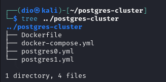

Dockerfile

```Docker
FROM postgres:15

# Ставим нужные для Patroni зависимости
RUN apt-get update -y && \
    apt-get install -y netcat-openbsd python3-pip curl python3-psycopg2 python3-venv iputils-ping

# Используем виртуальное окружение, доустанавливаем, собственно, Patroni
RUN python3 -m venv /opt/patroni-venv && \
    /opt/patroni-venv/bin/pip install --upgrade pip && \
    /opt/patroni-venv/bin/pip install patroni[zookeeper] psycopg2-binary

# Копируем конфигурацию для двух узлов кластера Patroni
COPY postgres0.yml /postgres0.yml
COPY postgres1.yml /postgres1.yml

ENV PATH="/opt/patroni-venv/bin:$PATH"

USER postgres
```

docker-compose.yml

```yaml
services:
  pg-master:
    build: .
    image: localhost/postres:patroni # имя для кастомного образа из Dockerfile, можно задать любое
    container_name: pg-master # Будущий адрес первой ноды
    restart: always
    hostname: pg-master
    environment:
      POSTGRES_USER: postgres
      POSTGRES_PASSWORD: postgres
      PGDATA: '/var/lib/postgresql/data/pgdata'
    expose:
      - 8008
    ports:
      - 5433:5432
    volumes:
      - pg-master:/var/lib/postgresql/data
    command: patroni /postgres0.yml

  pg-slave:
    build: .
    image: localhost/postres:patroni # имя для кастомного образа из Dockerfile, можно задать любое
    container_name: pg-slave # Будущий адрес второй ноды
    restart: always
    hostname: pg-slave
    expose:
      - 8008
    ports:
      - 5434:5432
    volumes:
     - pg-slave:/var/lib/postgresql/data
    environment:
      POSTGRES_USER: postgres
      POSTGRES_PASSWORD: postgres
      PGDATA: '/var/lib/postgresql/data/pgdata'
    command: patroni /postgres1.yml

  zoo:
    image: confluentinc/cp-zookeeper:7.7.1
    container_name: zoo # Будущий адрес зукипера
    restart: always
    hostname: zoo
    ports:
      - 2181:2181
    environment:
      ZOOKEEPER_CLIENT_PORT: 2181
      ZOOKEEPER_TICK_TIME: 2000

volumes:
  pg-master:
  pg-slave:
```

postgres0.yml

```yaml
scope: my_cluster # Имя нашего кластера 
name: postgresql0 # Имя первой ноды

restapi: # Адреса первой ноды
  listen: pg-master:8008
  connect_address: pg-master:8008

zookeeper:
    hosts:
      - zoo:2181 # Адрес Zookeeper

bootstrap:
  dcs:
    ttl: 30
    loop_wait: 10
    retry_timeout: 10
    maximum_lag_on_failover: 10485760
    master_start_timeout: 300
    synchronous_mode: true
    postgresql:
      use_pg_rewind: true
      use_slots: true
      parameters:
        wal_level: replica
        hot_standby: "on"
        wal_keep_segments: 8
        max_wal_senders: 10
        max_replication_slots: 10
        wal_log_hints: "on"
        archive_mode: "always"
        archive_timeout: 1800s
        archive_command: mkdir -p /tmp/wal_archive && test ! -f /tmp/wal_archive/%f && cp %p /tmp/wal_archive/%f

  pg_hba:
  - host replication replicator 0.0.0.0/0 md5
  - host all all 0.0.0.0/0 md5

postgresql:
  listen: 0.0.0.0:5432
  connect_address: pg-master:5432 # Адрес первой ноды
  data_dir: /var/lib/postgresql/data/postgresql0 # Место хранения данных первой ноды
  bin_dir: /usr/lib/postgresql/15/bin
  pgpass: /tmp/pgpass0
  authentication:
    replication: # логопасс для репликаци, при желании можно поменять
      username: replicator
      password: rep-pass
    superuser: # админский логопасс, при желании можно поменять (в том числе в файле compose)
      username: postgres
      password: postgres
  parameters:
    unix_socket_directories: '.'

watchdog:
  mode: off

tags:
    nofailover: false
    noloadbalance: false
    clonefrom: false
    nosync: false
```

postgres1.yml

```yaml
scope: my_cluster # Имя нашего кластера 
name: postgresql1 # Имя первой ноды

restapi: # Адреса первой ноды
  listen: pg-slave:8008
  connect_address: pg-slave:8008

zookeeper:
    hosts:
      - zoo:2181 # Адрес Zookeeper

bootstrap:
  dcs:
    ttl: 30
    loop_wait: 10
    retry_timeout: 10
    maximum_lag_on_failover: 10485760
    master_start_timeout: 300
    synchronous_mode: true
    postgresql:
      use_pg_rewind: true
      use_slots: true
      parameters:
        wal_level: replica
        hot_standby: "on"
        wal_keep_segments: 8
        max_wal_senders: 10
        max_replication_slots: 10
        wal_log_hints: "on"
        archive_mode: "always"
        archive_timeout: 1800s
        archive_command: mkdir -p /tmp/wal_archive && test ! -f /tmp/wal_archive/%f && cp %p /tmp/wal_archive/%f

  pg_hba:
  - host replication replicator 0.0.0.0/0 md5
  - host all all 0.0.0.0/0 md5

postgresql:
  listen: 0.0.0.0:5432
  connect_address: pg-slave:5432 # Адрес первой ноды
  data_dir: /var/lib/postgresql/data/postgresql1 # Место хранения данных первой ноды
  bin_dir: /usr/lib/postgresql/15/bin
  pgpass: /tmp/pgpass0
  authentication:
    replication: # логопасс для репликаци, при желании можно поменять
      username: replicator
      password: rep-pass
    superuser: # админский логопасс, при желании можно поменять (в том числе в файле compose)
      username: postgres
      password: postgres
  parameters:
    unix_socket_directories: '.'

watchdog:
  mode: off

tags:
    nofailover: false
    noloadbalance: false
    clonefrom: false
    nosync: false
```

Запускаем композ

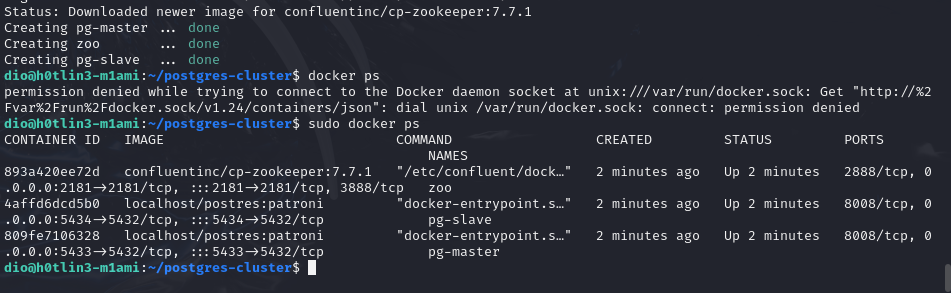

и проверяем логи контейнеров

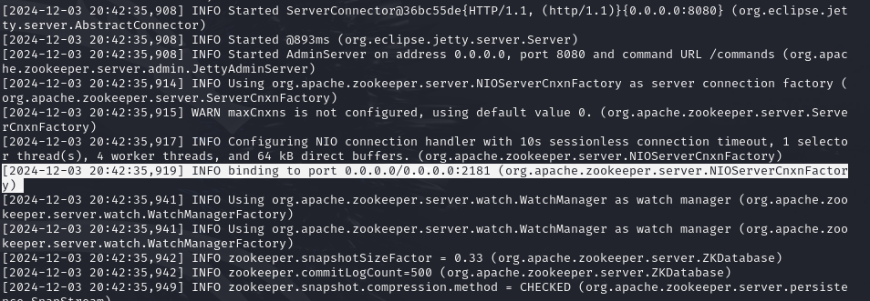

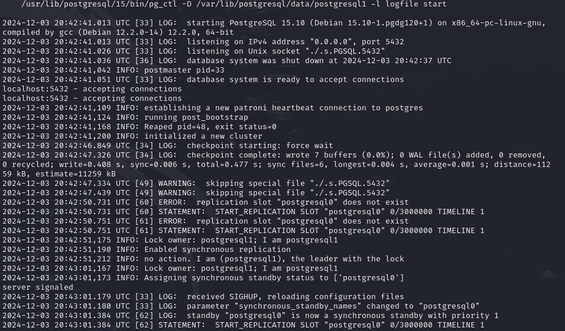

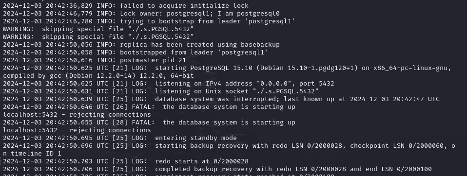

Заметим, что данжн master и slave поменялись местами.

## Проверяем репликацию

Будем использовать клиент для коннекта к бд psql. Подключаемся к обоим бд:

```SQL
psql -h localhost -p 5433 -U postgres # коннект к pg-master (который слэйв)
psql -h localhost -p 5434 -U postgres # коннект к pg-slave (который мастер)
```

В мастере создаём простую табличку tag:

```sql
CREATE TABLE tag (
id SERIAL PRIMARY KEY,
data VARCHAR(50),
value INT);
```

Из мастера же закинем пару объектов

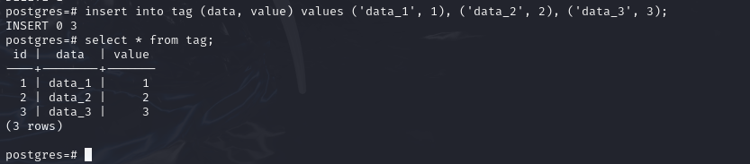

Убеждаемся в том, что в слейв подтянулась информация от мастера

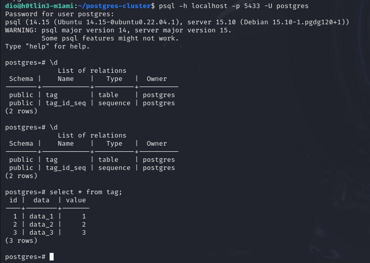

Здесь же, пытаемся добавить ещё строку и ловим ошибку, поскольку слэйв работает только в рид-онли режиме

```C
postgres=# insert into tag (data, value) values ('data_4', 4);
ERROR:  cannot execute INSERT in a read-only transaction
```

### Делаем высокую доступность

Осталось добавить балансировщик нагрузки и точку входа. Использовать будет HAproxy, который будет сочитать в себе обе фунциии

Добавить в докер-компоуз сервис хапрокси

```yaml
...
  haproxy:
    image: haproxy:3.0
    container_name: postgres_entrypoint # Это будет адрес подключения к БД, можно выбрать любой
    ports:
      - 5432:5432 # Это будет порт подключения к БД, можно выбрать любой
      - 7000:7000
    depends_on: # Не забываем убедиться, что сначала все корректно поднялось
      - pg-master
      - pg-slave
      - zoo
    volumes:
      - ./haproxy.cfg:/usr/local/etc/haproxy/haproxy.cfg
...
```

И соответственно его конфиг `haproxy.cfg`

```toml
global
    maxconn 100

defaults
    log global
    mode tcp
    retries 3
    timeout client 30m
    timeout connect 4s
    timeout server 30m
    timeout check 5s

listen stats
    mode http
    bind *:7000
    stats enable
    stats uri /

listen postgres
    bind *:5432 # Выбранный порт из docker-compose.yml
    option httpchk
    http-check expect status 200 # Описываем нашу проверку доступности (в данном случае обычный HTTP-пинг)
    default-server inter 3s fall 3 rise 2 on-marked-down shutdown-sessions
    server postgresql_pg_master_5432 pg-master:5432 maxconn 100 check port 8008 # Адрес первой ноды постгреса
    server postgresql_pg_slave_5432 pg-slave:5432 maxconn 100 check port 8008 # Адрес второй ноды постгреса
```

Чекаем логи

Новый мастер
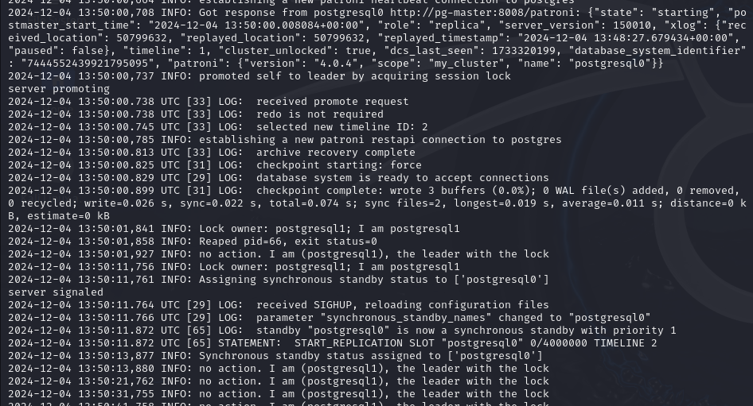

Новый слейв
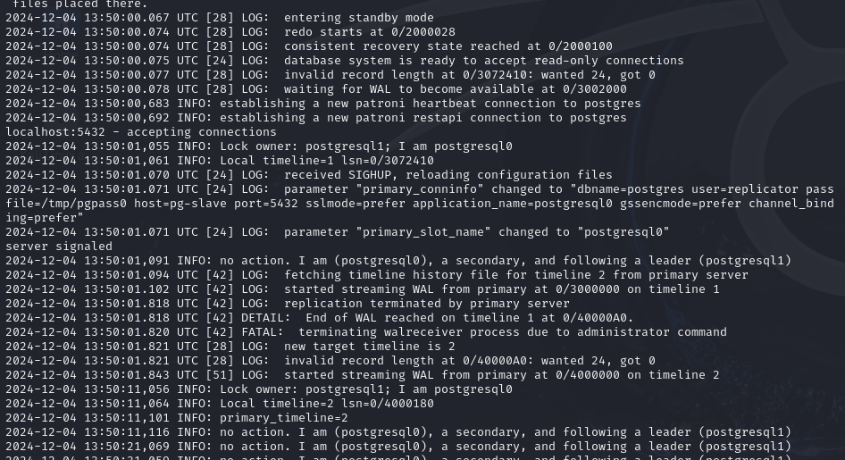

Балансировщик работает
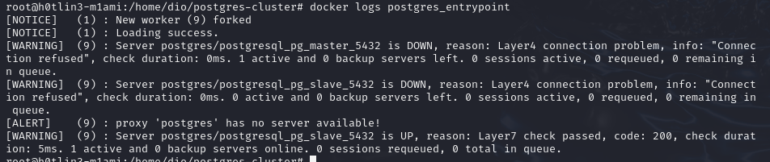

Проверяем точку входа на порту 5432

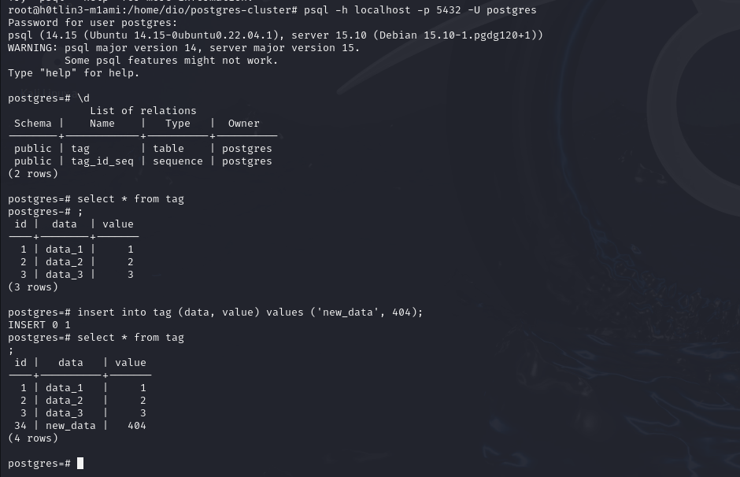

## Задание

Любым способом выключаем доступ до ноды, которая сейчас является мастером (например, через `docker stop`). Некоторое время ждем, после этого анализируем логи и так же пытаемся считать/записать что-то в БД через entrypoint подключение. Затем необходимо расписать, получилось или нет, а так же объяснить, что в итоге произошло после принудительного выключения мастера.

Стопаем контейнер pg-slave, который сейчас является мастером. Смотрим логи pg-master, postgres_entrypoint и zoo.

зукипер заметил отвалившийся коннект
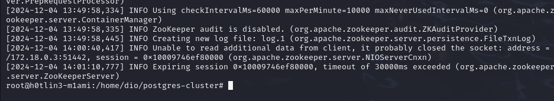

HAproxy заметил что мастер упал и вскоре обозначил нового мастера
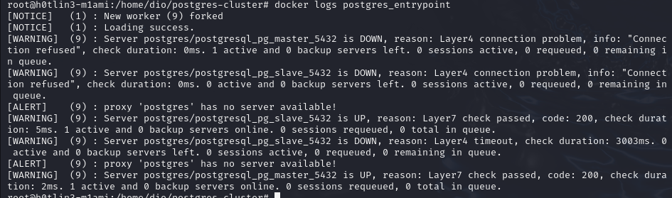

pg-master замечает отвалившийся коннект и пытается установить повторное подключение с мастером. Достигнув максимального количество ретраев, сам становится мастером.
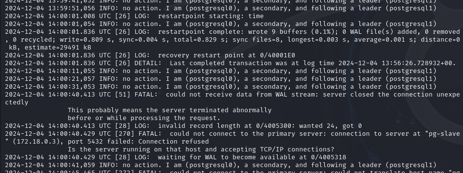
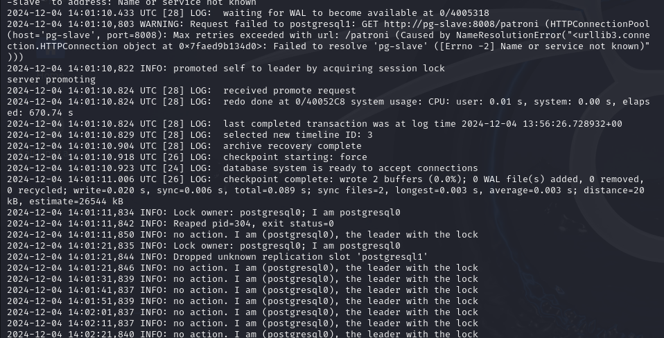

Чекаем ентрипоинт в бд

Подключение есть, база доступна, запись возможна.
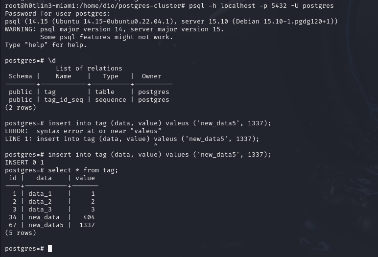

Собсна, что произошло? Когда мастер нода упала, патрони пытался переподключиться к ней некоторое количество раз. Достигнув максимума ретраев, патрони дёргает реплику и отдаёт ей мастер-сессию. HAproxy тоже заметил падение мастера и после появления нового перенаправил точку входа на неё. Так как система разобралось с данной аварией и переопределила мастера, то бд действительно продолжает функционировать. Чтение из базы и запись в неё доступны, только обращения идут к другой базе данных.

## Вопросы

1) Порты 8008 и 5432 вынесены в разные директивы, expose и ports. По сути, если записать 8008 в ports, то он тоже станет exposed. В чем разница?
    * Обе директивы открывают порты, по разному. Expose открывает порты во внутренней сети docker. Они доступны для использования только контейнерами для общения между собой. Ports в свою очередь открывает пробрасывает внутренний порт на внешний (соответственно директива принимает порты в виде внешний:внутренний). За пруф оф концепт здесь можно взять вывод команды `netstat -lntp`, которая показывает порты на прослушку. Здесь видно, что открыты все внешние порты, указанные в ports и нет портов expose. При этом в логах были моменты когда контейнеры бд обращались на 8008 порты и ошибок не было.

      ```bash
      root@h0tlin3-m1ami:/home/dio/postgres-cluster# netstat -lntp
      Active Internet connections (only servers)
      Proto Recv-Q Send-Q Local Address           Foreign Address         State       PID/Program name    
      tcp        0      0 0.0.0.0:2181            0.0.0.0:*               LISTEN      105223/docker-proxy 
      tcp        0      0 127.0.0.53:53           0.0.0.0:*               LISTEN      345/systemd-resolve 
      tcp        0      0 0.0.0.0:22              0.0.0.0:*               LISTEN      2328/sshd: /usr/sbi 
      tcp        0      0 127.0.0.1:45857         0.0.0.0:*               LISTEN      45869/containerd    
      tcp        0      0 0.0.0.0:5432            0.0.0.0:*               LISTEN      105438/docker-proxy 
      tcp        0      0 0.0.0.0:5433            0.0.0.0:*               LISTEN      105130/docker-proxy 
      tcp        0      0 0.0.0.0:5434            0.0.0.0:*               LISTEN      105167/docker-proxy 
      tcp        0      0 0.0.0.0:7000            0.0.0.0:*               LISTEN      105418/docker-proxy 
      tcp6       0      0 :::2181                 :::*                    LISTEN      105228/docker-proxy 
      tcp6       0      0 :::80                   :::*                    LISTEN      62980/apache2       
      tcp6       0      0 :::22                   :::*                    LISTEN      2328/sshd: /usr/sbi 
      tcp6       0      0 :::5432                 :::*                    LISTEN      105444/docker-proxy 
      tcp6       0      0 :::5433                 :::*                    LISTEN      105137/docker-proxy 
      tcp6       0      0 :::5434                 :::*                    LISTEN      105173/docker-proxy 
      tcp6       0      0 :::7000                 :::*                    LISTEN      105424/docker-proxy
      ```

2) При обычном перезапуске композ-проекта, будет ли сбилден заново образ? А если предварительно отредактировать файлы postgresX.yml? А если содержимое самого Dockerfile? Почему?

* При перезапуске компоуза наш образ не будет пересобран потому что компоуз использует уже существующие образы, которые есть на хосте.
* Редактирование конфига postgresX.yml также не приведёт к пересборке образа, потому что файл монтируется в контейнер как внешний том, а изменения будут применены при следующем запуске контейнера.
* Если отредактировать, то образ пересобирётся с флагом `--build`. Докер не отслеживает автоматически изменения докерфайлов.
